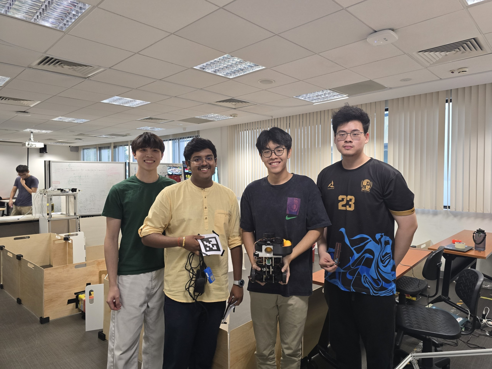

# CDE2310_Group1

Final submission and documentation of CDE2310 AY25/26 Group 1.

## About

The Group 1 AMR is a TurtleBot3 Burger-based autonomous mobile robot equipped with a custom ball-launcher payload.

**Capabilities**
- Autonomously navigates an unknown warehouse maze using SLAM and frontier-based exploration
- Detects ArUco-marked delivery stations
- Delivers ping pong balls into static and oscillating receptacles via a custom designed flywheel launcher

Full project documentation is available on our [GitHub Pages site](https://russell501.github.io/CDE2310_Group1/).

## Repository Structure

```
.
├── src/                        # ROS 2 source packages
│   ├── auto_nav/               # Main mission package (FSM, navigation, GUI, launch files)
│   ├── m-explore-ros2/         # Frontier-based exploration (explore_lite)
│   ├── turtlebot3_simulations/ # TurtleBot3 Gazebo simulation package
│   ├── py_pubsub/              # Basic ROS 2 publisher/subscriber package
│   └── testbed_pkg/            # LiDAR test package
│
├── software/                   # Standalone scripts and hardware test files
│   ├── docking/
│   │   ├── local/              # Docking test scripts to run on the local machine
│   │   └── rpi/                # ArUco detection and ball launcher code to run on the onboard RPi
│   ├── Navigation/             # Nav2 parameter files
│   └── system_test.py          # Pre-flight integration test
│
├── docs/                       # GitHub Pages documentation source
├── Electrical/                 # Electrical subsystem documentation and assets
├── Mechanical/                 # Mechanical subsystem documentation and CAD files
└── README.md
```

## The Team


## Final Run Screen Recording
https://youtu.be/CI83_B9eB-w
