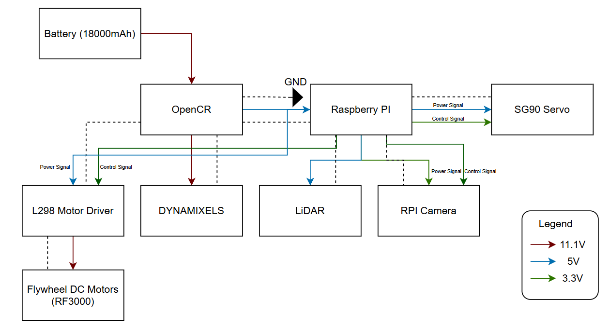

# 🔗 Navigation

- [Home](index.md)
- [Requirements](requirements.md)
- [Con-Ops](conops.md)
- [High Level Design](high-level-design.md)
- [Sub System Design](subsystem-design.md)
- [Interface Control Documents](icd.md)
- [Software Development](software.md)
- [Testing](testing.md)
- [User Manual](user-manual.md)
- [Bill-Of-Materials](bill-of-materials.md)
- **Electrical Subsystem** ← _You are here_
- [Mechanical Subsystem](Mechanical.md)

---

# Electrical Subsystem

The electrical subsystem covers all components critical to the mission: power distribution, motor control, sensor interfacing, and communication between the Raspberry Pi, OpenCR, and peripheral devices. This document details the system architecture, wiring connections, power budget, and testing outcomes.

---

## System Architecture

The Raspberry Pi acts as the central processing unit, coordinating all subsystems. It communicates with the OpenCR board via USB for motor control of the DYNAMIXEL servos, which drive the TurtleBot's wheels. The LiDAR sensor connects through a USB-to-UART interface module, providing obstacle detection data over UART. The RPi Camera connects directly to the Raspberry Pi via the CSI interface for visual feedback. The SG90 servo is driven directly by the Raspberry Pi using PWM signals over GPIO, and receives its power (5V) from the Raspberry Pi's 5V rail. The L298 motor driver is controlled via GPIO digital signals from the Raspberry Pi and is responsible for driving the two RF300 Series flywheel DC motors at 5V.

> **System Architecture / Communication Protocols Diagram**
> 

*Figure 1: System architecture showing communication protocols between all components (USB, UART, CSI, PWM, GPIO).*

---

## Power Distribution

Power is supplied by the TurtleBot3's onboard 11.1V LiPo battery (1800mAh). The OpenCR board receives 11.1V directly from the battery and distributes regulated voltages (5V, 3.3V) to the Raspberry Pi and other logic-level components. The Raspberry Pi is powered by the OpenCR's regulated output. The flywheel DC motors (RF300 Series) are powered at **5V** via the L298 motor driver, sourced from the Raspberry Pi's 5V GPIO rail, **not** from the OpenCR's 11.1V output anymore. The SG90 servo is powered from the Raspberry Pi's 5V rail.

> **Power Lines Architecture Diagram**
> 

*Figure 2: Power distribution diagram showing voltage levels (11.1V, 5V, 3.3V) to each component.*

---

## Electrical Schematic

The full circuit schematic shows all component connections including the OpenCR, Raspberry Pi GPIO header, L298N motor driver, DYNAMIXEL servos, LiDAR, SG90 servo, RPi Camera, and the RF300 flywheel motors. Key notes on the schematic:

- The flywheel motors are **no longer connected to the 11.1V output of the OpenCR**. They are now driven at **5V** through the L298 motor driver, with control signals from the Raspberry Pi GPIO.
- The L298 IN_HIGH and IN_LOW pins are connected directly to Raspberry Pi GPIO pins for directional control.
- A common GND is maintained across all components to ensure stable PWM and signal referencing.

> **Image Placeholder — Electrical Schematic**
> 

*Figure 3: Full electrical schematic showing all component connections.*

---

## Component Connections

### OpenCR
- Receives 11.1V directly from the LiPo battery.
- Connected to the Raspberry Pi via **USB** for ROS2-based communication and motor control of the DYNAMIXEL servos.
- Provides regulated power output to the Raspberry Pi.
- Controls the DYNAMIXEL XM-430 motors via **TTL Serial**.

### Raspberry Pi (Central Hub)
- Powered by the OpenCR's regulated output.
- Communicates with OpenCR over **USB**.
- Receives LiDAR data via a **USB-to-UART Interface Module** (LiDAR → UART → USB-to-UART Module → USB → RPi).
- RPi Camera connected via **CSI** interface.
- Controls SG90 servo via **PWM** on a GPIO pin; servo is powered from the 5V rail.
- Sends **Digital GPIO** control signals to the L298 motor driver for flywheel motor direction and speed.

### L298 Motor Driver
- Receives directional control signals (IN_HIGH, IN_LOW) from Raspberry Pi GPIO.
- Powers the two RF300 Series flywheel DC motors at **5V**.
- Power input sourced from the Raspberry Pi's 5V rail (suitable given the low power output of the RF300 motors).

### RF300 Series Flywheel DC Motors (×2)
- Operating voltage: **5V**
- Output power: approximately **0.05 – 0.50W** per motor
- Driven by the L298 motor driver.
- Two motors spin in opposite directions to launch the ping pong ball.

### SG90 Servo
- Controlled via **PWM** signal from Raspberry Pi GPIO.
- Powered from Raspberry Pi **5V** rail.
- Used to actuate the ball-loading or aiming mechanism.

### LiDAR Sensor
- Communicates via **UART** to a USB-to-UART Interface Module.
- The module converts the signal to **USB** for connection to the Raspberry Pi.

### RPi Camera
- Connected to Raspberry Pi via **CSI** (Camera Serial Interface).
- Powered at **3.3V** from the Raspberry Pi.

---

## Power Budget

| Component | Voltage (V) | Current (A) | Qty | Power (W) | Time | Energy (J) |
|---|---|---|---|---|---|---|
| SG90 Servo | 5.0V | 0.248A | 1 | 1.24W | 20 sec | 24.8 |
| RF300 Flywheel DC Motor | 5.0V | 0.1A | 2 | 0.5W each (1.0W total) | 3 min | 180 |
| TurtleBot (Startup) | 11.1V | 0.7745A | 1 | 8.6W | 30 sec | 258 |
| TurtleBot (Operation) | 11.1V | 0.5702A | 1 | 6.3W | 20 min | 7560 |
| TurtleBot (Standby) | 11.1V | 0.4866A | 1 | 5.4W | 5 min | 1620 |
| RPi Camera | 3.3V | 0.250A | 1 | 0.825W | 20 min | 990 |
| LiDAR Sensor | 5.0V | 0.200A | 1 | 1.0W | 20 min | 1200 |
| **TOTAL** | | | | | | **11,832.8 J (3.28 Wh)** |

**Battery Capacity:**
- Battery: 11.1V × 1.8Ah × 0.9 (efficiency factor) = **17.98 Wh**
- Energy per mission run: **3.28 Wh**
- Estimated missions per charge: **~5 runs**

---

## Testing and Validation

### Raspberry Pi Instability - Odometry and Push Capability Issues

One of the most significant issues encountered was **instability in the Raspberry Pi's performance during operation**. This manifested as erratic odometry readings and unreliable pushing behaviour of the TurtleBot. The root cause is suspected to be related to power supply noise or GPIO interference, possibly stemming from the shared power rails between the Raspberry Pi and other peripherals.

A strongly suspected contributing factor is the **SG90 servo receiving unintended PWM signals** even when it was not meant to be active. This was observed as random servo jitter or movement during phases of operation where the servo should have been idle. The spurious PWM signals may have introduced noise onto the 5V rail, disrupting the Raspberry Pi's stable operation and indirectly affecting ROS2 processes responsible for odometry and motion control. Further investigation is needed to confirm this causal link, potential fixes include adding a dedicated decoupling capacitor on the servo power line, or using a separate regulated 5V supply for the servo.

### Servo PWM Interference

As noted above, the SG90 servo was observed to occasionally receive unintended PWM signals during ROS2 startup and operation. This is consistent with GPIO noise during Raspberry Pi boot sequences. The issue was partially mitigated by manually repositioning the servo between runs. A longer-term fix would be to implement a hardware enable/disable circuit (e.g., a transistor gate) on the servo signal line, or to add a pull-down resistor on the PWM GPIO pin to suppress floating signals during boot.

### Wiring Failures - Soldering Required

Multiple instances of wire breaks and loose connections were encountered throughout the development and testing phases. Joints that were initially secured with jumper wires or breadboard connections proved unreliable under the mechanical stress of the TurtleBot's movement. Affected connections included motor driver signal wires and servo power leads. These were resolved by **soldering the connections** and reinforcing with heat shrink tubing. All critical connections in the final build should be soldered rather than relying on push-fit connectors.

### Motor Voltage Adjustment

The original design routed flywheel motor power from the OpenCR's 11.1V output, which was found to be excessive for the RF300 Series motors. The design was revised to supply the motors at **5V via the L298 motor driver**, powered from the Raspberry Pi's 5V rail. This change better matches the RF300's operating range (0.05–0.50W output) and reduced the risk of motor damage from overvoltage.

---

## Areas for Improvement

- Implement hardware filtering or a dedicated servo controller to prevent unintended PWM signals during boot.
- Measure and validate all estimated current draws in the power budget with a multimeter or current probe during live operation.
- Add decoupling capacitors on the 5V and 3.3V rails near sensitive components to reduce noise.
- Investigate use of a separate 5V BEC (Battery Eliminator Circuit) for the servo to isolate it from the Raspberry Pi's power rail.
- Replace all breadboard/jumper wire connections with soldered joints in the final build.
- Add a limit switch or encoder feedback to the ball-loading servo mechanism for repeatable positioning.

---

## Risk Mitigation

### Surge Current

**Problem:** Simultaneous flywheel startup → stall current → RPi voltage drop below 4.75V → hard reset.

**Mitigation:**
- Characterise individual stall currents for each motor before full system integration.
- Stagger motor start-up sequentially rather than simultaneously.
- Verify RPi voltage remains ≥ 4.75V under worst-case load conditions.

---

### EMI Interference

**Problem:** Rapid motor current changes → EMI on communication lines → bad sensor data, dropped packets.

**Mitigation:**
- Physically separate signal wires from motor power wires in the cable routing.
- Add decoupling capacitors across motor terminals to suppress switching noise.
- Use twisted pair wiring for communication signal lines where possible.

---

### Back EMF Damage

**Problem:** Back-EMF or high-voltage spikes from the motors damaging the Raspberry Pi GPIO pins.

**Mitigation:**
- Install an Optoisolator (PWM Isolator) between the RPi and the L298N motor driver to protect GPIO pins from voltage spikes.