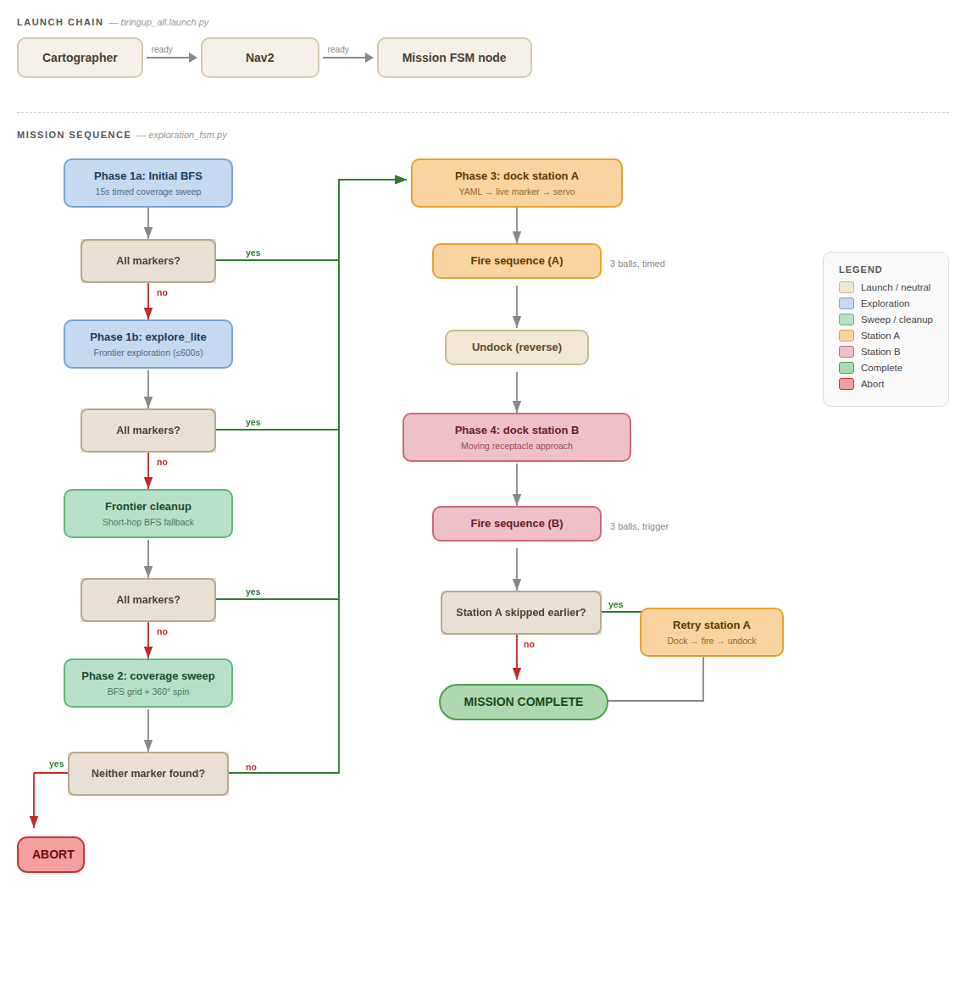

# 🔗 Navigation

- [Home](index.md)
- [The Challenge](challenge.md)
- [General System](general-system.md)
- [Software Subsystem](software.md)
- [Mechanical Subsystem](mechanical.md)
- [Electrical Subsystem](electrical.md)
- [End User Documentation & BOM](user_docs.md)
- [Areas for Improvement](improvements.md)

---

# General System

*System architecture showing data (black) and power (green) flows across all four subsystems.*

---

## Subsystem Decomposition

The system is decomposed into four interdependent subsystems, each responsible for a distinct aspect of the mission:

**Navigation Subsystem** - Responsible for autonomous exploration, mapping, localisation, and goal-directed path planning. The robot builds a real-time occupancy grid of the unknown maze using LiDAR-based SLAM (Cartographer), explores unmapped regions via frontier-based navigation (explore_lite), and executes obstacle-free paths to delivery stations using the Nav2 stack with DWB local planner.

**Sensor Subsystem** - Provides environmental perception through two complementary sensors. The LDS-02 LiDAR delivers 360° range data for SLAM map construction and obstacle avoidance. The RPi Camera V2, driven by a standalone detection script (`aruco_live.py`) running directly on the RPi, handles ArUco marker detection and 6D pose estimation, publishing marker poses to ROS 2 for station localisation and docking alignment.

**Launcher Subsystem** - Handles payload storage, feeding, and delivery. Nine ping pong balls are stored in a gravity-fed curved tube that does not obstruct the LiDAR field of view. A servo-actuated gate controls ball release into a dual counter-rotating flywheel mechanism, which launches balls with consistent velocity and trajectory. An IR break-beam sensor at the barrel exit confirms each successful launch.

**Computation Subsystem** - The Raspberry Pi 4B serves as the primary compute platform, running all ROS 2 nodes including SLAM, navigation, marker detection, and mission control. The OpenCR 1.0 board handles low-level motor control, IMU data, and encoder feedback. All inter-subsystem communication occurs through ROS 2 topics and services, and the entire system is deployable from a single launch file.

---

## Mission Flow Overview

*End-to-end mission flow from boot to mission completion.*

The mission follows a sequential pipeline with built-in fallback layers at each stage:

### 1. Setup & Boot

The robot is placed at the designated start zone and powered on. A single ROS 2 launch file initialises all nodes - SLAM, navigation, marker detection, and mission control. The system waits for a valid map and robot localisation before proceeding.

### 2. Autonomous Exploration

The robot explores the unknown maze using a multi-layered approach. An initial rapid sweep seeds the map, followed by frontier-based exploration that systematically targets boundaries between known and unknown space. If the primary exploration completes without finding all station markers, additional fallback strategies (frontier cleanup and coverage sweeping) are engaged automatically. A standalone ArUco detection script runs on the RPi throughout - any station marker sighted during exploration is immediately published to ROS 2, localised in the map frame by the mission controller, and stored for later docking.

### 3. Station A - Static Delivery

Once Station A's marker has been detected, the robot navigates to the station using a coarse-to-fine docking strategy. It first approaches the general area using the stored marker pose, then acquires a live camera sighting for refined alignment, and finally performs a precision visual-servo approach to reach the optimal firing position. The flywheel launcher spins up and delivers three balls following the team-specific timing delay pattern. After delivery, the robot reverses to clear the station.

### 4. Station B - Dynamic Delivery

Station B follows the same coarse-to-fine docking pipeline, but with tighter alignment tolerances to account for the moving receptacle. Rather than firing on a timed schedule, the launcher waits for a trigger signal - a secondary ArUco marker on the receptacle indicates when the hole has aligned with the robot. Each ball is fired on detection of this trigger, with a cooldown period between shots to prevent double-firing on the same pass.

### 5. Mission Complete

After both stations have been serviced, the mission controller publishes a completion signal and logs the final state.

---

## Integration Strategy

### Centralised Mission Controller

A single ROS 2 node - the mission controller - acts as the orchestrator for the entire system. It manages high-level phase transitions (exploration → docking → delivery → transit), coordinates between subsystems, and handles fault recovery. This centralised approach was chosen over a behaviour tree or distributed architecture for simplicity and debuggability within the project timeline.

### Coarse-to-Fine Docking

Docking at both stations uses a three-stage approach that transitions control authority from the navigation stack to direct visual servoing:

1. **Nav2 global planning** brings the robot to the station's general vicinity using stored map coordinates
2. **Live marker refinement** updates the approach vector using a fresh camera sighting, correcting for any SLAM drift
3. **Direct cmd_vel control** performs final alignment and approach using real-time camera feedback, handling the precision requirements that Nav2's goal tolerances cannot satisfy

This layered handoff ensures reliable docking across the full range - from initial discovery distance (~2 m) down to the camera's minimum focus range (~0.3 m) and the final target distance (0.10 m).

### Fault Tolerance

The system incorporates several fault recovery mechanisms:

- **Multi-layer exploration fallback** - If the primary frontier explorer fails to locate all markers, the system automatically escalates through progressively more thorough search strategies before proceeding with whatever markers have been found
- **Marker search patterns** - If a marker is not visible when the robot arrives at its stored location, a 360° spin search is performed before declaring failure
- **Docking retries** - Each station docking attempt is retried up to 3 times with fresh marker acquisition between attempts
- **State persistence** - Detected marker poses are persisted to disk, allowing the mission to skip exploration entirely on a re-attempt within the same session

---

## Communication Architecture

*RQT graph showing the ROS 2 node communication topology.*

All subsystem communication occurs through ROS 2 topics and services with appropriate QoS profiles. The key data flows are:

- **LiDAR → SLAM → Navigation:** Laser scans feed into Cartographer for map generation, which in turn feeds Nav2 for path planning and obstacle avoidance
- **Camera → Mission Controller:** ArUco detections provide marker poses for station localisation and real-time visual feedback during docking
- **Mission Controller → Navigation:** Goal poses are published to the Nav2 action server during exploration and station approach
- **Mission Controller → Launcher:** Service calls trigger flywheel start/stop and ball release at the appropriate moments during delivery
- **Mission Controller → Monitoring:** Phase status and diagnostic topics enable real-time mission monitoring via RViz and logging

---

## Why This Design?

This architecture was selected to balance reliability, development speed, and debuggability within the project constraints:

- **Single orchestrator** keeps the mission logic traceable and easy to debug under time pressure, versus a distributed or behaviour-tree approach that would require more development overhead
- **Coarse-to-fine docking** bridges the gap between Nav2's goal tolerance (~25 cm) and the mission's docking precision requirement (~2 cm lateral), without requiring a custom navigation plugin
- **Multi-layer exploration** ensures robustness against maze configurations where any single exploration strategy might miss dead-end corridors or occluded markers
- **Shared docking pipeline** for both stations minimises code duplication - only the firing logic differs between static and dynamic delivery
- **YAML state persistence** eliminates redundant exploration on mission retries, which is critical when operating within a 25-minute window that includes setup and cleanup

---

## [Software Subsystem →](software.md)