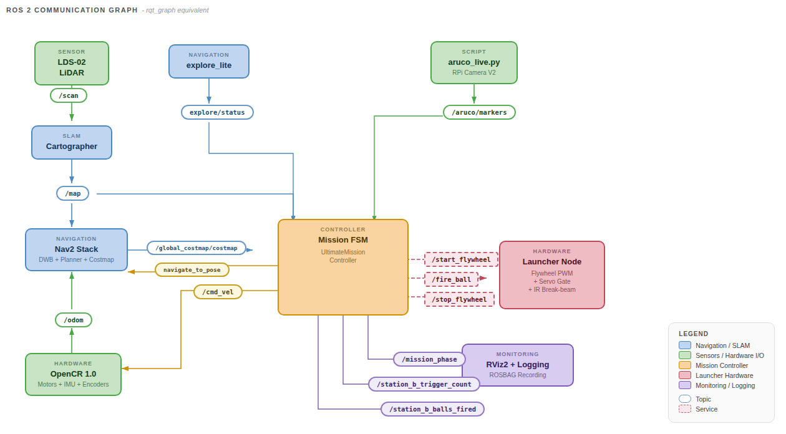

# 🔗 Navigation

- [Home](index.md)
- [Requirements](requirements.md)
- [Con-Ops](conops.md)
- **High Level Design** ← _You are here_
- [Sub System Design](subsystem-design.md)
- [Interface Control Documents](icd.md)
- [Software Development](software.md)
- [Testing](testing.md)
- [User Manual](user-manual.md)

---
# High Level Design

---

## System Architecture

*System architecture showing data (black) and power (green) flows across all four subsystems.*

The system architecture consists of four interdependent subsystems connected through a combination of ROS 2 topics and services, hardware communication buses, and power distribution networks. The Raspberry Pi 4B acts as the central processing hub, coordinating all subsystems.

The data flow architecture follows a layered approach: sensor data feeds into perception and mapping algorithms, which in turn feed the mission controller's decision-making logic, which commands both the navigation stack and the launcher hardware.

---

## Subsystem Overview

### Navigation Subsystem

Responsible for autonomous exploration, mapping, localisation, and goal-directed path planning. Key components:

| Component | Technology | Role |
|---|---|---|
| SLAM | Google Cartographer | Real-time occupancy grid mapping from LiDAR + IMU + encoders |
| Exploration | explore_lite + custom BFS | Multi-layered frontier exploration with fallback strategies |
| Path Planning | Nav2 with NavFn (A*) | Global collision-free path computation |
| Local Control | DWB (Dynamic Window Approach) | Real-time velocity commands for obstacle avoidance |
| Drive Motors | 2 × Dynamixel XL430-W250 | Differential drive via OpenCR 1.0 TTL serial |

### Sensor Subsystem

Provides environmental perception through two complementary sensors:

| Sensor | Interface | Purpose |
|---|---|---|
| LDS-02 LiDAR | UART → USB-to-UART Module → USB → RPi | 360° range data for SLAM and obstacle avoidance |
| RPi Camera V2 (IMX219, 8MP) | CSI → RPi | ArUco marker detection and 6D pose estimation |
| IMU (OpenCR onboard) | USB (via OpenCR) | Orientation refinement and drift correction for SLAM |
| Wheel Encoders (Dynamixel) | TTL Serial (via OpenCR) | Odometry for inter-scan motion prediction |

### Launcher Subsystem

Handles payload storage, feeding, and delivery:

| Component | Specification | Role |
|---|---|---|
| Ball Storage | Curved gravity-feed tube, 9-ball capacity | Stores ping pong balls without obstructing LiDAR FOV |
| Flywheel Motors | 2 × RF300 Series DC motors at 5V | Dual counter-rotating flywheels for ball launch |
| Motor Driver | L298N H-Bridge | Direction and speed control for flywheel motors |
| Servo Gate | SG90 Micro Servo (PWM, 5V) | Actuates ball release into the flywheel mechanism |
| Barrel Guide | Custom 3D-printed part | Directs ball trajectory through flywheels |
| Feeder Roller | Custom 3D-printed part | Feeds balls from storage into the barrel |

### Computation Subsystem

| Component | Role |
|---|---|
| Raspberry Pi 4B | Primary compute — runs all ROS 2 nodes (SLAM, Nav2, mission controller, ArUco detection) |
| OpenCR 1.0 | Low-level motor control, IMU data, and encoder feedback for Dynamixel servos |

---

## Power Architecture

*Power distribution diagram showing voltage levels (11.1V, 5V, 3.3V) to each component.*

Power is supplied by the TurtleBot3's onboard 11.1V LiPo battery (1800 mAh). The power distribution follows a hierarchical voltage regulation scheme:

| Voltage Rail | Source | Consumers |
|---|---|---|
| 11.1V | LiPo battery (direct) | OpenCR 1.0, Dynamixel XL430 motors |
| 5V | OpenCR regulated output → RPi 5V rail | Raspberry Pi 4B, L298N motor driver, SG90 servo, LiDAR sensor, flywheel motors (via L298N) |
| 3.3V | RPi regulated output | RPi Camera V2 |

**Power Budget Summary:**

| Component | Power (W) | Duration | Energy (J) |
|---|---|---|---|
| TurtleBot (Operation) | 6.3 | 20 min | 7,560 |
| TurtleBot (Startup) | 8.6 | 30 sec | 258 |
| TurtleBot (Standby) | 5.4 | 5 min | 1,620 |
| LiDAR Sensor | 1.0 | 20 min | 1,200 |
| RPi Camera | 0.825 | 20 min | 990 |
| SG90 Servo | 1.24 | 20 sec | 24.8 |
| Flywheel Motors (×2) | 1.0 total | 3 min | 180 |
| **Total per mission** | | | **~11,833 J (3.28 Wh)** |

Battery capacity: 11.1V × 1.8Ah × 0.9 (efficiency) = 17.98 Wh → approximately 5 mission runs per charge.

---

## Communication Architecture

*RQT graph showing the ROS 2 node communication topology.*

All subsystem communication occurs through ROS 2 topics and services with appropriate QoS profiles. The key data flows are:

**LiDAR → SLAM → Navigation:** Laser scans feed into Cartographer for map generation, which feeds Nav2 for path planning and obstacle avoidance.

**Camera → Mission Controller:** ArUco detections provide marker poses for station localisation and real-time visual feedback during docking.

**Mission Controller → Navigation:** Goal poses are published to the Nav2 action server during exploration and station approach.

**Mission Controller → Launcher:** Service calls (`/start_flywheel`, `/fire_ball`, `/stop_flywheel`) trigger flywheel and ball release at appropriate moments during delivery.

**Mission Controller → Monitoring:** Phase status and diagnostic topics enable real-time monitoring via RViz and the mission GUI.

---

## Integration Strategy

### Centralised Mission Controller

A single ROS 2 node — the `UltimateMissionController` — acts as the orchestrator for the entire system. It manages high-level phase transitions (exploration → docking → delivery → transit), coordinates between subsystems, and handles fault recovery. This centralised approach was chosen over a behaviour tree or distributed architecture for simplicity and debuggability within the project timeline.

### Coarse-to-Fine Docking

Docking at both stations uses a three-stage approach that transitions control authority from the navigation stack to direct visual servoing:

1. **Nav2 global planning** brings the robot to the station's general vicinity using stored map coordinates.
2. **Live marker refinement** updates the approach vector using a fresh camera sighting, correcting for SLAM drift.
3. **Direct cmd_vel control** performs final alignment and approach using real-time camera feedback.

This layered handoff ensures reliable docking across the full range — from initial discovery distance (~2 m) down to the camera's minimum focus range (~0.3 m) and the final target distance (0.10 m).

### Single-File Deployment

The entire robot system launches from `bringup_all.launch.py`, which starts Cartographer, Nav2, and the mission FSM in dependency order using event-driven triggers (no blind timers). The ArUco detection script runs as a standalone process on the RPi. This satisfies the bonus scoring criteria for single-file deployment.

---

## Design Rationale

This architecture was selected to balance reliability, development speed, and debuggability within the project constraints:

| Decision | Rationale |
|---|---|
| Single orchestrator FSM | Keeps mission logic traceable and easy to debug under time pressure, versus behaviour trees or distributed architectures |
| Coarse-to-fine docking | Bridges the gap between Nav2's goal tolerance (~25 cm) and the mission's docking precision requirement (~2 cm lateral) |
| Multi-layer exploration | Ensures robustness against maze configurations where any single strategy might miss dead-end corridors or occluded markers |
| Shared docking pipeline | Both stations share the same approach logic — only the firing sequence differs, minimising code duplication |
| YAML state persistence | Eliminates redundant exploration on mission retries, critical when operating within a 25-minute window |
| Cartographer over SLAM Toolbox | Superior map quality is critical for reliable docking alignment; higher CPU load is acceptable on RPi 4B |
| DWB over MPPI | Proven reliability in indoor corridors with lower computational overhead; sufficient for structured maze environments |
