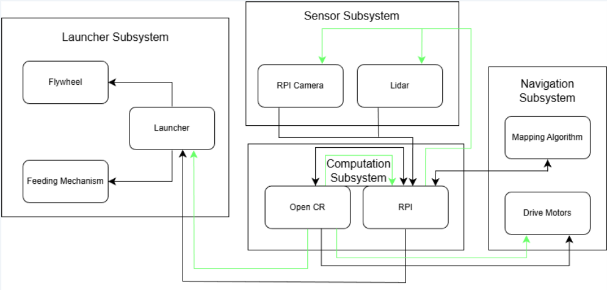

# 🔗 Navigation

- **Home** ← _You are here_
- [Requirements](requirements.md)
- [Con-Ops](conops.md)
- [High Level Design](high-level-design.md)
- [Sub System Design](subsystem-design.md)
- [Interface Control Documents](icd.md)
- [Software Development](software.md)
- [Testing](testing.md)
- [User Manual](user-manual.md)
- [Bill-Of-Materials](bill-of-materials.md)
- [Electrical Subsystem](electrical.md)

---
# Project Overview

## Autonomous Mobile Robot for Smart Warehouse Intralogistics

**Course:** CDE2310 — Fundamentals of Systems Design (AY 25-26)
**Institution:** NUS EDIC
**Team:** Group 1 — Russell, Shandrico, Alex, Moksh
**Software Version:** v1.0.0

---

## Mission Statement

This project delivers a TurtleBot3 Burger-based autonomous mobile robot (AMR) that navigates an unknown warehouse maze, detects delivery stations via ArUco markers, and dispenses ping pong balls into receptacles — all within a 25-minute window with no human teleoperation. The mission comprises three objectives: static delivery at Station A, dynamic delivery at Station B (oscillating receptacle), and an optional elevator traversal to Level 2 via REST API.

---

## System Summary

*System architecture showing data and power flows across all four subsystems.*

| Parameter | Value |
|---|---|
| Platform | TurtleBot3 Burger + custom launcher payload |
| Total Mass | 1402.24 g (1.40 kg) |
| Overall Dimensions (L × W × H) | 138 mm × 178 mm × 192 mm |
| Battery | Li-Po 11.1 V, 1800 mAh |
| Compute | Raspberry Pi 4B + OpenCR 1.0 |
| Sensors | LDS-02 LiDAR, RPi Camera Module V2 (8 MP, IMX219) |
| Drive | 2 × Dynamixel XL430-W250 |
| Launcher | Dual counter-rotating flywheels (2 × RF300 DC motor) + SG90 servo gate |
| Ball Storage | 9 ping pong balls (curved gravity-feed tube) |
| Mission Window | 25 minutes |

---

## Subsystem Decomposition

The system is decomposed into four interdependent subsystems:

**Navigation Subsystem** — Responsible for autonomous exploration, mapping, localisation, and goal-directed path planning. The robot builds a real-time occupancy grid of the unknown maze using LiDAR-based SLAM (Cartographer), explores unmapped regions via frontier-based navigation (explore_lite), and executes obstacle-free paths using the Nav2 stack with DWB local planner.

**Sensor Subsystem** — Provides environmental perception through two complementary sensors. The LDS-02 LiDAR delivers 360° range data for SLAM map construction and obstacle avoidance. The RPi Camera V2 handles ArUco marker detection and 6D pose estimation, publishing marker poses to ROS 2 for station localisation and docking alignment.

**Launcher Subsystem** — Handles payload storage, feeding, and delivery. Nine ping pong balls are stored in a gravity-fed curved tube that does not obstruct the LiDAR field of view. A servo-actuated gate controls ball release into a dual counter-rotating flywheel mechanism, which launches balls with consistent velocity and trajectory.

**Computation Subsystem** — The Raspberry Pi 4B serves as the primary compute platform, running all ROS 2 nodes including SLAM, navigation, marker detection, and mission control. The OpenCR 1.0 board handles low-level motor control, IMU data, and encoder feedback. All inter-subsystem communication occurs through ROS 2 topics and services, and the entire system is deployable from a single launch file.

---

## Key Performance Highlights

| Metric | Specification |
|---|---|
| SLAM Map Resolution | ≤ 0.05 m/cell |
| Obstacle Reaction Latency | < 100 ms |
| Marker Detection Range | 0.3–2.2 m (640×480, 5 cm marker) |
| Docking Tolerance | Lateral ±2 cm, Angular ±3°, Distance 0.2–1.0 m |
| Battery Life | ~4–5 full mission runs per charge |

---

## Documentation Map

| Document | Description |
|---|---|
| [Requirements](requirements.md) | Functional, non-functional requirements, constraints, and system specifications |
| [Con-Ops](conops.md) | Concept of Operations — mission phases, operational scenarios, and environment |
| [High Level Design](high-level-design.md) | System architecture, subsystem decomposition, and design rationale |
| [Sub System Design](subsystem-design.md) | Detailed design for electrical, mechanical, and software subsystems |
| [Interface Control Documents](icd.md) | Interface definitions, communication protocols, and data flows |
| [Software Development](software.md) | Software architecture, ROS 2 nodes, algorithms, and source code structure |
| [Testing](testing.md) | Testing methodology, results, and system integration test procedures |
| [User Manual](user-manual.md) | Setup, deployment, operation, troubleshooting, and maintenance |
