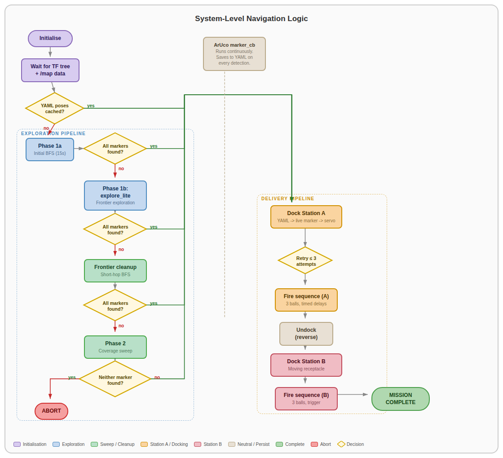

# 🔗 Navigation

- [Home](index.md)
- [Requirements](requirements.md)
- [Con-Ops](conops.md)
- [High Level Design](high-level-design.md)
- [Sub System Design](subsystem-design.md)
- [Interface Control Documents](icd.md)
- **Software Development** ← _You are here_
- [Testing](testing.md)
- [User Manual](user-manual.md)

---
# Software/Firmware Development Documentation

---

## 1. Software Architecture Overview

The software system is built on ROS 2 Humble running on the Raspberry Pi 4B. It consists of a central mission controller FSM, a standalone ArUco detection pipeline, a hardware launcher controller, and the standard TurtleBot3/Nav2 stack components.

### 1.1 ROS 2 Packages

| Package | Description |
|---|---|
| `auto_nav` | Primary package containing the mission controller, exploration FSM, and launch files |
| `py_pubsub` | Utility package for basic ROS 2 publisher/subscriber testing |
| `testbed_pkg` | Testbed package for early assignment exercises |
| `turtlebot3_simulations` | Standard TurtleBot3 Gazebo simulation environment |

### 1.2 Node and Script Registry

| Executable / Script | Entry Point | Run Location | Purpose |
|---|---|---|---|
| `mission_controller` | `auto_nav.exploration_fsm:main` | Laptop (via launch file) | Central mission FSM — orchestrates exploration, docking, and delivery |
| `mission_gui` | `auto_nav.mission_gui:main` | Laptop (manual) | Tkinter-based GUI for real-time mission monitoring |
| `aruco_live.py` | Standalone script | RPi (via SSH) | Camera capture, ArUco detection, pose estimation, ROS 2 publishing |
| `ball_launcher.py` | Standalone script | RPi (via SSH) | ROS 2 services for flywheel and servo hardware control |
| `aruco_dock.py` | Standalone script | Laptop (manual) | Standalone docking test — Nav2 + cmd_vel approach to a single marker |
| `station_b_launcher.py` | Standalone script | Laptop (manual) | Standalone Station B fire sequence test (assumes already docked) |
| `system_test.py` | Standalone script | Laptop (manual) | Pre-flight integration test with Tkinter GUI |
| `bringup_all.launch.py` | Launch file | Laptop | Unified launch: Cartographer → Nav2 → Mission FSM (event-driven) |

---

## 2. Mission Controller (`exploration_fsm.py`)


*System-level navigation logic showing the full mission FSM from initialisation through exploration, docking, and delivery.*


### 2.1 Finite State Machine

The `UltimateMissionController` is a single ROS 2 node that acts as the orchestrator for the entire mission. It manages high-level phase transitions and coordinates between all subsystems. The FSM follows this sequence:

1. **Initialisation** — Wait for SLAM map and valid TF transforms.
2. **Phase 1a** — Initial BFS coverage sweep (15 s budget).
3. **Phase 1b** — Frontier exploration via explore_lite (up to 600 s).
4. **Phase 1c** — Frontier cleanup BFS (short-hop, time-decaying blacklist).
5. **Phase 2** — Full coverage sweep (last resort, if markers still missing).
6. **Station A Docking & Delivery** — Coarse-to-fine approach + timed fire sequence.
7. **Station B Docking & Delivery** — Coarse-to-fine approach + trigger-based fire sequence.
8. **Mission Complete** — Publish completion signal and log final state.

The controller exits early from exploration as soon as all required markers (Station A and B) are detected.

### 2.2 Key Configuration Parameters

| Parameter | Value | Description |
|---|---|---|
| `TARGET_DISTANCE` | 0.10 m | Final dock distance from marker |
| `NAV2_APPROACH_DISTANCE` | 0.35 m | Runway distance for live marker approach |
| `YAML_APPROACH_DISTANCE` | 0.60 m | Coarse approach distance using stored pose |
| `MAX_DOCK_RETRIES` | 3 | Maximum docking attempts per station |
| `UNDOCK_DISTANCE` | 0.30 m | Reverse distance after Station A delivery |
| `STATION_A_FIRE_DELAYS` | [6.0, 9.0, 1.0] | Team-specific timing delays (seconds before each ball) |
| `STATION_B_BALLS` | 3 | Number of balls to fire at Station B |
| `TRIGGER_COOLDOWN` | 5.0 s | Wait after firing for trigger marker to clear |
| `EXPLORATION_TIMEOUT` | 600 s | Maximum time for explore_lite |
| `INITIAL_BFS_DURATION` | 15 s | Time budget for initial BFS sweep |
| `FRONTIER_BLACKLIST_TTL` | 90 s | Time-decaying blacklist entry lifetime |
| `FRONTIER_BLACKLIST_RADIUS` | 0.30 m | Exclusion radius around failed frontier goals |
| `FRONTIER_HOP_DISTANCE` | 0.60 m | Maximum travel per frontier cleanup hop |

### 2.3 Visual Servo Control Parameters

| Parameter | Value | Description |
|---|---|---|
| `K_LINEAR` | 0.3 m/s per m | Proportional gain for forward velocity |
| `K_ANGULAR` | 1.5 rad/s per m | Proportional gain for angular correction |
| `MAX_LINEAR` | 0.08 m/s | Maximum forward speed during approach |
| `MAX_ANGULAR` | 0.50 rad/s | Maximum angular speed during alignment |
| `ALIGN_TOL_A` | 0.03 m | Lateral tolerance for Station A |
| `ALIGN_TOL_B` | 0.01 m | Lateral tolerance for Station B (tighter for moving target) |
| `BLIND_THRESHOLD` | 0.20 m | cam_z below which camera detection is unreliable |
| `LOST_MARKER_S` | 3.0 s | Tolerated gap before declaring marker lost |

---

## 3. Exploration Strategy

### 3.1 Multi-Layered Pipeline

| Stage | Strategy | Purpose |
|---|---|---|
| Phase 1a | Timed BFS Coverage Sweep | Rapid initial map seeding across known free space (15 s budget) |
| Phase 1b | explore_lite (frontier-based) | Systematic frontier exploration with up to 600 s timeout |
| Phase 1c | Frontier Cleanup (short-hop BFS) | Targeted cleanup of remaining frontiers that explore_lite missed |
| Phase 2 | Full Coverage Sweep | Exhaustive BFS visit of every reachable free cell as last resort |

### 3.2 Frontier Cleanup Algorithm (Phase 1c)

1. BFS from the robot's current position across free cells to find the nearest frontier.
2. Trace the BFS parent chain to get a path through known free space.
3. Navigate along this path in short hops (0.6 m increments).
4. After each hop, the map has updated from new LiDAR scans; BFS is recomputed.

Robustness features: time-decaying blacklist (TTL = 90 s, radius = 0.30 m) prevents oscillation; costmap clearance checking (0.22 m) ensures navigable targets; recovery spins (360°) trigger after 3 consecutive failures; frontier clustering groups connected cells and snaps goals to reachable centroids.

---

## 4. SLAM and Navigation

### 4.1 Cartographer SLAM

Google Cartographer fuses three data sources for real-time SLAM:

| Source | Purpose |
|---|---|
| LDS-02 LiDAR | 360° range measurements for scan matching and map construction |
| Wheel Encoders | Odometry estimates for inter-scan motion prediction |
| IMU | Inertial data for orientation refinement and drift correction |

Map output: occupancy grid at 0.05 m/cell resolution — free (0), occupied (100), unknown (-1) — published on `/map`.

### 4.2 Nav2 Stack Configuration

| Component | Selection | Role |
|---|---|---|
| Global Planner | NavFn (A*) | Shortest collision-free path through global costmap |
| Local Controller | DWB (Dynamic Window Approach) | Real-time velocity commands for obstacle avoidance |
| Costmap | Global + Local layers | Inflated obstacle layers for safe path planning |
| Recovery Behaviors | Spin, BackUp, Wait | Automated recovery when the robot gets stuck |

Key `burger.yaml` parameters: `xy_goal_tolerance: 0.25`, `controller_frequency: 10.0 Hz`, `robot_radius: 0.17 m` (local) / `0.1 m` (global), `inflation_radius: 0.25 m`, `cost_scaling_factor: 1.5`.

### 4.3 Algorithm Selection Rationale

**Cartographer over SLAM Toolbox:** Superior map quality critical for docking alignment; higher CPU load acceptable on RPi 4B.

**DWB over MPPI:** Proven reliability in indoor corridors with lower computational overhead; response latency consistently under 100 ms. MPPI offers smoother trajectories in open spaces but adds unnecessary complexity for structured maze corridors.

---

## 5. ArUco Detection Pipeline (`aruco_live.py`)

### 5.1 Pipeline Stages

1. **Capture** — Frames at 640×480 resolution, 30 FPS via V4L2.
2. **Preprocessing** — Grayscale conversion for improved bit-pattern recognition.
3. **Detection** — `cv2.aruco.ArucoDetector` with `DICT_6X6_250` identifies marker boundaries.
4. **Pose Estimation** — `cv2.solvePnP` with `SOLVEPNP_IPPE_SQUARE` extracts rotation vector (rvec) and translation vector (tvec) from the marker's four corner points and the camera calibration matrix (loaded from `.npz` file).
5. **Quaternion Conversion** — rvec → rotation matrix via `cv2.Rodrigues` → unit quaternion (x, y, z, w) using Shepperd trace method.
6. **ROS 2 Publishing** — Detected markers published on `/aruco/markers` as `visualization_msgs/MarkerArray`.

### 5.2 Camera Calibration

Camera intrinsic matrix (K) and distortion coefficients are loaded from `/home/ubuntu/calibration.npz`. The marker object points are defined as a 4-point square at the physical marker size (5 cm default).

### 5.3 Camera-to-Map Coordinate Transform

When the mission controller receives a marker, it transforms camera-frame coordinates to map-frame:

1. Look up `map → base_link` TF to get robot pose and yaw.
2. Apply camera X offset (4 cm lateral) and project camera-frame point into map frame.
3. Extract marker outward normal direction from orientation quaternion (defines docking approach heading).
4. Store as `(map_x, map_y, normal_yaw)` in detected markers dictionary.

---

## 6. Docking Logic

### 6.1 Coarse-to-Fine Approach

**Stage 1 — Coarse Nav2 Approach:** Navigate to standoff point 0.6 m from stored marker position along its normal direction using Nav2 global planner.

**Stage 2 — Live Marker Acquisition:** Wait for fresh camera sighting (360° spin search if not visible). Update pose to correct SLAM drift. New Nav2 goal at 0.35 m from live position.

**Stage 3 — Visual Servo (cmd_vel):** Three sub-phases — Align (rotate until |cam_x| < tolerance), Drive (forward + angular correction until blind threshold), Dead-reckon (fixed speed through camera blind zone to reach 0.10 m target).

### 6.2 Station A — Timed Fire Sequence

1. Flywheel spin-up via `/start_flywheel`.
2. Wait 6.0 s → fire ball 1 via `/fire_ball`.
3. Wait 9.0 s → fire ball 2.
4. Wait 1.0 s → fire ball 3.
5. Flywheel stop via `/stop_flywheel`.
6. Undock — reverse 0.30 m at 0.06 m/s.

### 6.3 Station B — Trigger-Based Fire Sequence

1. Dock with 1 cm lateral tolerance.
2. Flywheel spin-up.
3. Wait for trigger marker (ArUco ID 2) detection → fire ball.
4. Cooldown 5.0 s (prevent double-fire on same receptacle pass).
5. Repeat for 3 balls total (30 s timeout per ball).
6. Flywheel stop.

---

## 7. Launcher Hardware Controller (`ball_launcher.py`)

Runs on the RPi as a ROS 2 node exposing three services:

| Service | Behaviour |
|---|---|
| `/start_flywheel` | Sets both Motor A and Motor B to `forward(1.0)` via `gpiozero.Motor` |
| `/fire_ball` | Triggers servo actuation (placeholder — servo implementation pending) |
| `/stop_flywheel` | Calls `stop()` on both motors |

GPIO configuration: Motor A (fwd=23, bwd=24, en=13), Motor B (fwd=22, bwd=27, en=12). Graceful degradation to simulation mode if `gpiozero` is not available.

---

## 8. Source Code Structure

```
├── docs/                              # Documentation markdown files
│   ├── challenge.md                   # Problem definition and requirements
│   ├── general-system.md              # System architecture overview
│   ├── software.md                    # Software subsystem documentation
│   ├── docking.md                     # Docking & delivery subsystem
│   ├── improvements.md                # Areas for improvement
│   └── assets/                        # Diagrams and images
├── software/
│   ├── Navigation/Params/burger.yaml  # Nav2 parameter configuration
│   ├── docking/
│   │   ├── local/
│   │   │   ├── aruco_dock.py          # Standalone docking test (laptop)
│   │   │   ├── aruco_dock_and_launch_test.py
│   │   │   ├── aruco_dock_moving.py   # Moving target docking test
│   │   │   └── station_b_launcher.py  # Standalone Station B fire test
│   │   └── rpi/
│   │       ├── aruco_live.py          # ArUco detection (runs on RPi)
│   │       └── ball_launcher.py       # Hardware launcher controller (RPi)
│   └── system_test.py                # Pre-flight integration test with GUI
├── src/
│   ├── auto_nav/                      # Primary ROS 2 package
│   │   ├── auto_nav/
│   │   │   ├── exploration_fsm.py     # Mission controller FSM (1368 lines)
│   │   │   ├── mission_gui.py         # Tkinter mission monitoring GUI
│   │   │   ├── r2auto_nav.py          # Earlier navigation prototype
│   │   │   ├── r2mover.py             # Basic movement node
│   │   │   ├── r2moverotate.py        # Move and rotate node
│   │   │   ├── r2occupancy.py         # Occupancy grid utilities
│   │   │   ├── r2occupancy2.py        # Occupancy grid utilities v2
│   │   │   └── r2scanner.py           # LiDAR scanner utilities
│   │   ├── launch/
│   │   │   └── bringup_all.launch.py  # Unified launch file
│   │   ├── package.xml
│   │   └── setup.py
│   ├── py_pubsub/                     # Basic pub/sub test package
│   ├── testbed_pkg/                   # Assignment testbed package
│   └── turtlebot3_simulations/        # Standard TurtleBot3 simulation
├── Electrical/                        # Electrical subsystem documentation
│   ├── Electrical.md
│   └── assets/images/                 # Circuit and architecture diagrams
└── Mechanical/
    └── CAD Files/                     # SolidWorks parts and assemblies
```

---

## 9. Build and Deployment

### 9.1 Build Commands

```bash
# Install dependencies
rosdep install --from-paths src --ignore-src -r -y

# Build workspace
colcon build --symlink-install

# Source the workspace
source install/setup.bash
```

### 9.2 Deployment Sequence

1. Power on TurtleBot3.
2. SSH into Raspberry Pi.
3. On RPi: `python3 main_launch.py` (starts aruco_live.py and ball_launcher.py).
4. On laptop: `ros2 run auto_nav mission_gui` (start monitoring GUI).
5. On laptop: `ros2 launch auto_nav bringup_all.launch.py` (start mission).
6. Monitor via RViz and mission GUI.

### 9.3 Parameter Tuning

After modifying `burger.yaml` or mission controller parameters, rebuild:

```bash
colcon build --packages-select auto_nav
source install/setup.bash
```

---

## 10. Visualization and Debugging

### 10.1 RViz Monitoring

- Live occupancy grid map from Cartographer
- Robot pose and TF tree
- Nav2 planned paths and costmaps
- ArUco marker detections

### 10.2 Mission Phase Logging

The controller publishes the current mission phase on `/mission_phase` as a String topic. Phase transitions are logged to the ROS 2 logger. At Station B, additional diagnostics track trigger detection count and balls fired.

### 10.3 Safety Mechanisms

- Immediate Nav2 goal cancellation when all markers found during exploration.
- Flywheel activation only after confirmed docking; always stopped via service call after firing.
- Marker loss handling: abort approach if marker lost > 3 seconds.
- Mission abort if no markers found after all exploration strategies.
- Post-delivery undock to prevent blocking the receptacle.
