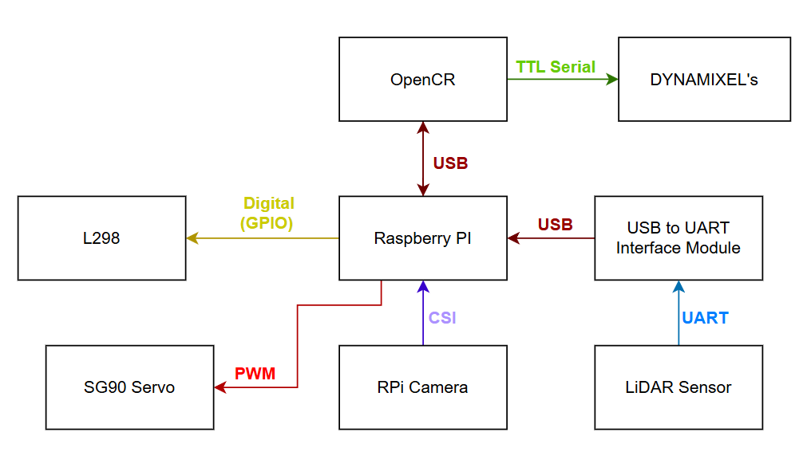
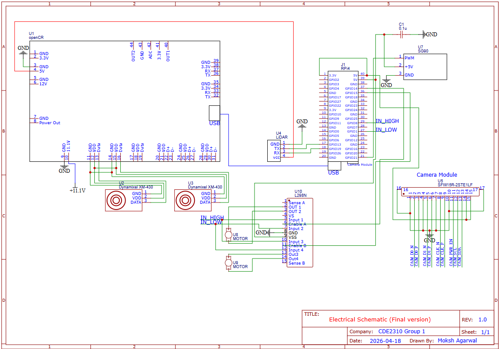

# 🔗 Navigation

- [Home](index.md)
- [Requirements](requirements.md)
- [Con-Ops](conops.md)
- [High Level Design](high-level-design.md)
- **Sub System Design** ← _You are here_
- [Interface Control Documents](icd.md)
- [Software Development](software.md)
- [Testing](testing.md)
- [User Manual](user-manual.md)
- [Bill-Of-Materials](bill-of-materials.md)
- [Electrical Subsystem](electrical.md)
- [Mechanical Subsystem](Mechanical.md)

---
# Sub System Design

---

## 1. Electrical Subsystem

### 1.1 System Architecture

*Communication protocols between all components (USB, UART, CSI, PWM, GPIO).*

The Raspberry Pi acts as the central processing unit, coordinating all subsystems. It communicates with the OpenCR board via USB for motor control of the DYNAMIXEL servos, which drive the TurtleBot's wheels. The LiDAR sensor connects through a USB-to-UART interface module, providing obstacle detection data over UART. The RPi Camera connects directly to the Raspberry Pi via the CSI interface for visual feedback. The SG90 servo is driven directly by the Raspberry Pi using PWM signals over GPIO, and receives its power (5V) from the Raspberry Pi's 5V rail. The L298 motor driver is controlled via GPIO digital signals from the Raspberry Pi and is responsible for driving the two RF300 Series flywheel DC motors at 5V.

### 1.2 Power Distribution

*Power distribution diagram showing voltage levels (11.1V, 5V, 3.3V) to each component.*

Power is supplied by the TurtleBot3's onboard 11.1V LiPo battery (1800mAh). The OpenCR board receives 11.1V directly from the battery and distributes regulated voltages (5V, 3.3V) to the Raspberry Pi and other logic-level components. The Raspberry Pi is powered by the OpenCR's regulated output. The flywheel DC motors (RF300 Series) are powered at 5V via the L298 motor driver, sourced from the Raspberry Pi's 5V GPIO rail. The SG90 servo is powered from the Raspberry Pi's 5V rail.

### 1.3 Component Connections

**OpenCR:**
- Receives 11.1V directly from the LiPo battery.
- Connected to the Raspberry Pi via USB for ROS2-based communication and motor control of the DYNAMIXEL servos.
- Provides regulated power output to the Raspberry Pi.
- Controls the DYNAMIXEL XM-430 motors via TTL Serial.

**Raspberry Pi (Central Hub):**
- Powered by the OpenCR's regulated output.
- Communicates with OpenCR over USB.
- Receives LiDAR data via a USB-to-UART Interface Module (LiDAR → UART → USB-to-UART Module → USB → RPi).
- RPi Camera connected via CSI interface.
- Controls SG90 servo via PWM on a GPIO pin; servo powered from the 5V rail.
- Sends Digital GPIO control signals to the L298 motor driver for flywheel motor direction and speed.

**L298 Motor Driver:**
- Receives directional control signals (IN_HIGH, IN_LOW) from Raspberry Pi GPIO.
- Powers the two RF300 Series flywheel DC motors at 5V.
- Power input sourced from the Raspberry Pi's 5V rail (suitable given the low power output of the RF300 motors).

**RF300 Series Flywheel DC Motors (×2):**
- Operating voltage: 5V
- Output power: approximately 0.05–0.50W per motor
- Driven by the L298 motor driver.
- Two motors spin in opposite directions to launch the ping pong ball.

**SG90 Servo:**
- Controlled via PWM signal from Raspberry Pi GPIO.
- Powered from Raspberry Pi 5V rail.
- Used to actuate the ball-loading gate mechanism.

**LiDAR Sensor (LDS-02):**
- Communicates via UART to a USB-to-UART Interface Module.
- The module converts the signal to USB for connection to the Raspberry Pi.

**RPi Camera V2:**
- Connected to Raspberry Pi via CSI (Camera Serial Interface).
- Powered at 3.3V from the Raspberry Pi.

### 1.4 Power Budget

| Component | Voltage (V) | Current (A) | Qty | Power (W) | Time | Energy (J) |
|---|---|---|---|---|---|---|
| SG90 Servo | 5.0 | 0.248 | 1 | 1.24 | 20 sec | 24.8 |
| RF300 Flywheel DC Motor | 5.0 | 0.1 | 2 | 0.5 each (1.0 total) | 3 min | 180 |
| TurtleBot (Startup) | 11.1 | 0.7745 | 1 | 8.6 | 30 sec | 258 |
| TurtleBot (Operation) | 11.1 | 0.5702 | 1 | 6.3 | 20 min | 7,560 |
| TurtleBot (Standby) | 11.1 | 0.4866 | 1 | 5.4 | 5 min | 1,620 |
| RPi Camera | 3.3 | 0.250 | 1 | 0.825 | 20 min | 990 |
| LiDAR Sensor | 5.0 | 0.200 | 1 | 1.0 | 20 min | 1,200 |
| **TOTAL** | | | | | | **11,832.8 J (3.28 Wh)** |

Battery capacity: 11.1V × 1.8Ah × 0.9 (efficiency) = 17.98 Wh → ~5 mission runs per charge.

### 1.5 Electrical Schematic Notes

*Full electrical schematic showing all component connections.*

- The flywheel motors are driven at 5V through the L298 motor driver, with control signals from the Raspberry Pi GPIO (not the 11.1V OpenCR output — this was revised after initial testing revealed overvoltage risk).
- The L298 IN_HIGH and IN_LOW pins connect directly to Raspberry Pi GPIO pins for directional control.
- A common GND is maintained across all components to ensure stable PWM and signal referencing.

### 1.6 Risk Mitigation

**Surge Current:** Simultaneous flywheel startup can cause stall current that drops RPi voltage below 4.75V. Mitigation: stagger motor start-up sequentially, verify RPi voltage remains ≥ 4.75V under worst-case load.

**EMI Interference:** Rapid motor current changes can introduce EMI on communication lines. Mitigation: physically separate signal wires from motor power wires, add decoupling capacitors across motor terminals, use twisted pair wiring for communication lines.

**Back EMF Damage:** Back-EMF spikes from motors can damage RPi GPIO pins. Mitigation: install an optoisolator (PWM isolator) between the RPi and the L298N motor driver.

---

## 2. Mechanical Subsystem

### 2.1 Platform

The robot uses the TurtleBot3 Burger as the base platform, which provides the multi-layer plate structure, ball casters, Dynamixel motor mounts, and LiDAR mounting point.

### 2.2 Physical Specifications

| Parameter | Value |
|---|---|
| Total Mass | 1402.24 g (1.40 kg) |
| Overall Dimensions (L × W × H) | 138 mm × 178 mm × 192 mm |
| Centre of Gravity — X (back +) | −56.7 mm from ball-caster origin |
| Centre of Gravity — Y (up) | 95.3 mm from ground |
| Centre of Gravity — Z (left +) | 2.8 mm from ball-caster origin |

### 2.3 Custom Mechanical Components

The following custom components are mounted on the TurtleBot3 Burger platform as the launcher payload. All custom parts were designed in SolidWorks (assembly: TurtleBot Assembly V3.1.2):

| Component | File | Purpose |
|---|---|---|
| 50 mm Flywheel | `50 mm flywheel.SLDPRT` | Flywheel disc mounted on each RF300 motor shaft for ball acceleration |
| Ball Storage | `Ball Storage.SLDPRT` | Curved gravity-feed tube holding up to 9 ping pong balls; designed to not obstruct LiDAR 360° FOV |
| Barrel Guide | `Barrel Guide.SLDPRT` | Directs ball trajectory through the dual counter-rotating flywheel gap |
| Feeder Roller | `Feeder Roller.SLDPRT` | Feeds balls from the storage tube into the barrel guide |
| SG90 Servo Mount | `SG90 - Micro Servo 9g - Tower Pro.5-1.SLDPRT` | Mounting bracket for the servo gate actuator |

### 2.4 TurtleBot3 Base Components

The TurtleBot3 Burger base consists of multi-level plate assemblies connected by hex standoffs:

- **First Floor Assembly** — Base plate with Dynamixel motor mounts and ball caster.
- **Connected Plates** — Intermediate plate assemblies providing structural rigidity and component mounting.
- **Fourth Floor Assembly** — Top plate for LiDAR mounting.
- **Ball Caster Assembly** — Rear support with steel ball (3/8 inch) and caster cover.
- **LiDAR Assembly** — LDS-02 LiDAR sensor mount.
- **Fasteners** — M3 nuts, M2.5×12 and M3×6 pan head screws, hex standoffs (M3×35 and M3×45 FF), M3 threaded inserts, and inter-board brackets.

### 2.5 Design Constraints

- All mounted components must not obstruct the LDS-02 LiDAR's 360° field of view.
- The ball storage tube follows a curved path to stay below the LiDAR plane while maintaining gravity-feed functionality.
- The centre of gravity must remain low for stable navigation; the mounted payload must not shift during transit.
- The robot must be compact enough to navigate narrow maze corridors without wall contact.

---

## 3. Launcher Subsystem

### 3.1 Operating Principle

The launcher uses a dual counter-rotating flywheel mechanism. Two RF300 DC motors, each fitted with a 50 mm flywheel disc, spin in opposite directions. When a ping pong ball is released by the SG90 servo gate, it passes between the two spinning flywheels and is accelerated by friction, launching it with consistent velocity and trajectory.

### 3.2 Ball Feed Path

1. **Storage:** 9 ping pong balls sit in a curved gravity-feed tube.
2. **Gate:** The SG90 servo actuates a gate that releases one ball at a time into the feed path.
3. **Feeder Roller:** Guides the ball from the gate into the barrel guide.
4. **Barrel Guide:** Channels the ball between the two counter-rotating flywheels.
5. **Launch:** The ball exits through the flywheel gap with the desired velocity.

### 3.3 Motor Configuration

| Parameter | Value |
|---|---|
| Motor Model | RF300 Series (PEL00882) DC Motor |
| Quantity | 2 (counter-rotating) |
| Operating Voltage | 5V (via L298N motor driver) |
| Output Power | 0.05–0.50W per motor |
| RPM Range | 2,100–14,350 RPM (variable via PWM) |
| Control | Raspberry Pi GPIO → L298N (IN_HIGH/IN_LOW for direction) |

### 3.4 Servo Gate Configuration

| Parameter | Value |
|---|---|
| Model | SG90 Micro Servo 9g (Tower Pro) |
| Operating Voltage | 5V (from RPi 5V rail) |
| Control Signal | PWM from Raspberry Pi GPIO |
| Actuation Speed | ≤ 0.12 s/60° |
| Purpose | Gate control for single-ball release |

### 3.5 GPIO Pin Assignments (Launcher Hardware)

| Signal | GPIO Pin | Direction | Description |
|---|---|---|---|
| Motor A Forward | GPIO 23 | Output | L298N IN1 — Motor A direction |
| Motor A Backward | GPIO 24 | Output | L298N IN2 — Motor A direction |
| Motor A Enable | GPIO 13 | Output (PWM) | L298N ENA — Motor A speed |
| Motor B Forward | GPIO 22 | Output | L298N IN3 — Motor B direction |
| Motor B Backward | GPIO 27 | Output | L298N IN4 — Motor B direction |
| Motor B Enable | GPIO 12 | Output (PWM) | L298N ENB — Motor B speed |
| SG90 Servo | GPIO (PWM pin) | Output (PWM) | Servo gate control |
